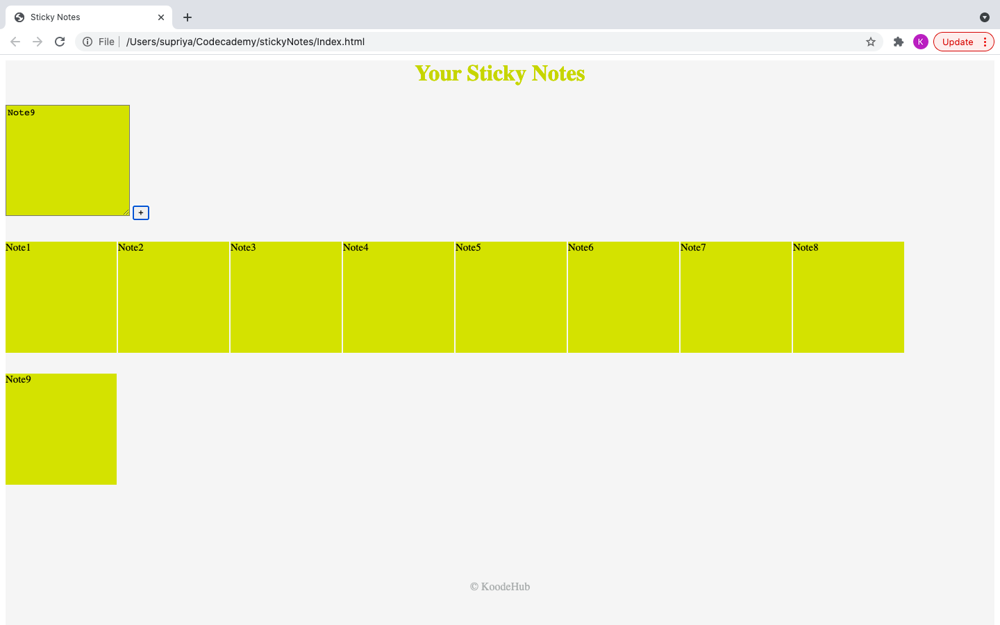

# Sticky Notes
    . A note taking app creating using javascript.
# Description
    . App has a quick form to add a note with a '+' button. 
    . Once the user click the add button the notes gets stacked on the white board.
# Technology stack
    . HTML 
    . CSS 
    . JAVASCRIPT 
# HOMEPAGE
